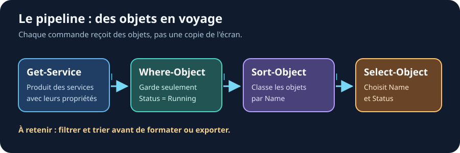

<nav class="ps-chapter-path" aria-label="Parcours du chapitre">
  <a href="https://kayasam.github.io/powershell/cours/09-pipeline/cours"><b>01 · Cours</b><small>Comprendre les notions</small></a>
  <a href="https://kayasam.github.io/powershell/cours/09-pipeline/cours-interactif"><b>02 · Cours interactif</b><small>Schéma et défi rapide</small></a>
  <a href="https://kayasam.github.io/powershell/cours/09-pipeline/quiz"><b>03 · Quiz</b><small>Vérifier ses acquis</small></a>
  <a href="https://kayasam.github.io/powershell/cours/09-pipeline/tp/"><b>04 · Travaux pratiques</b><small>Appliquer en autonomie</small></a>
</nav>

> [!TIP] Ressources du chapitre
>
> - [[09-pipeline/tp/index|Exercices pratiques]]
> - [[Memo-Commandes|Mémo des commandes]]

## Le pipeline : enchaîner les commandes

Le `|` passe la sortie d'une cmdlet vers la suivante.

```powershell
Get-Process | Sort-Object CPU -Descending | Select-Object -First 5
```

Lisez-le comme une phrase : "Obtiens les processus, trie-les par CPU, garde les 5 premiers."



Le trait entre deux étapes représente des **objets transmis**, pas une ligne de texte déjà affichée. Chaque commande reçoit le résultat de la précédente et peut encore le filtrer ou le transformer.

## Where-Object : filtrer

```powershell
# Processus qui consomment plus de 100 MB
Get-Process | Where-Object WorkingSet -gt 100MB

# Services qui tournent
Get-Service | Where-Object Status -eq "Running"

# Fichiers modifiés aujourd'hui
Get-ChildItem | Where-Object LastWriteTime -gt (Get-Date).Date
```

**Raccourci** : `where` ou `?`

```powershell
Get-Service | ? Status -eq "Running"
```

### Filtres avec bloc de script

Pour les conditions complexes :

```powershell
Get-Process | Where-Object { $_.CPU -gt 10 -and $_.Name -ne "idle" }
```

## Sort-Object : trier

```powershell
# Trier par nom (A → Z)
Get-Process | Sort-Object Name

# Trier par mémoire (plus gros en premier)
Get-Process | Sort-Object WorkingSet -Descending

# Trier sur plusieurs colonnes
Get-Service | Sort-Object Status, Name
```

**Raccourci** : `sort`

## Select-Object : choisir

```powershell
# Choisir des colonnes
Get-Process | Select-Object Name, Id, CPU

# Premier / dernier
Get-Process | Select-Object -First 10
Get-Process | Select-Object -Last 5

# Colonne calculée
Get-Process | Select-Object Name, @{Name="RAM (MB)"; Expression={[math]::Round($_.WorkingSet/1MB,1)}}
```

**Raccourci** : `select`

## Group-Object : regrouper

```powershell
# Grouper les services par statut
Get-Service | Group-Object Status

# Grouper les fichiers par extension
Get-ChildItem | Group-Object Extension
```

## Measure-Object : mesurer

```powershell
# Compter
Get-Process | Measure-Object

# Statistiques sur une propriété
Get-Process | Measure-Object CPU -Sum -Average -Maximum
```

## Combiner le tout

```powershell
# Trouver les 3 services actifs avec le nom le plus long
Get-Service |
    Where-Object Status -eq "Running" |
    Sort-Object { $_.DisplayName.Length } -Descending |
    Select-Object -First 3 DisplayName, Status
```

## À retenir

✅ `|` passe les objets d'une cmdlet à l'autre
✅ `Where-Object` (ou `?`) pour filtrer
✅ `Sort-Object` pour trier
✅ `Select-Object` pour choisir les colonnes
✅ `Measure-Object` pour compter/calculer

> **Lien**
>
> - [À propos du pipeline](https://learn.microsoft.com/fr-fr/powershell/module/microsoft.powershell.core/about/about_pipelines)
